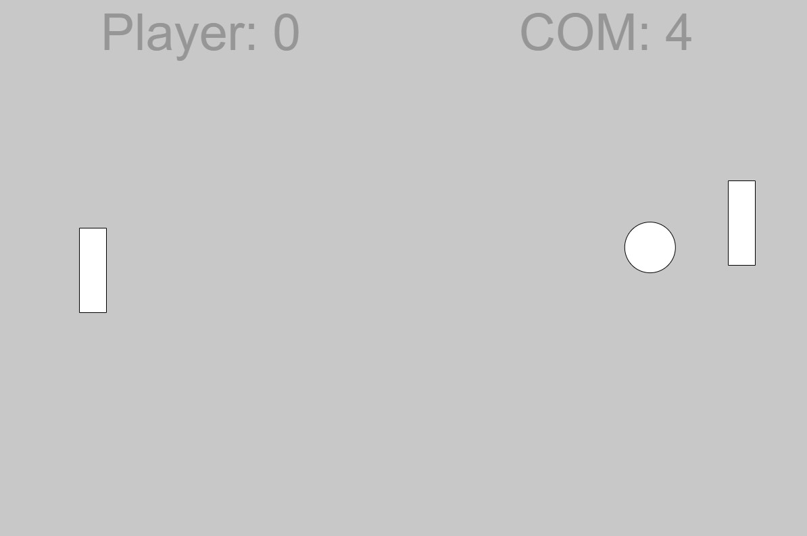

# impossible-pong
Unbeatable pong game made in Processing

Very simple, definitely has its bugs, particularly the ball getting trapped in the top of the paddle, bouncing around and then reversing direction.
It has a light and dark theme.
The AI is really hard to beat. It was inspired by [this](https://www.youtube.com/watch?v=tcymhYbRvw8) video by CodeBullet. 
You can play the [web](https://www.weirdy.dev/pong) version here and the Android version [here](https://play.google.com/store/apps/details?id=com.weirdydev.impossiblepong).

